# GlobeTrotter – Comprehensive Hackathon Architecture & Team Execution Plan

## 1. Executive Summary & Vision

**GlobeTrotter** is an end-to-end, personalized multi-city travel planning platform built for the Odoo Hackathon. The platform enables users to:
1. Authenticate and manage personalized travel profiles.
2. Search and discover destinations, cities, and categorized activities.
3. Build dynamic, multi-stop itineraries with automated day-wise budgeting and cost calculation.
4. Visualize trips via interactive timeline, day flowcharts, and calendar views.
5. Share itineraries in a public community where others can view, like, and "Copy Trip" into their own accounts.
6. Provide an Admin Analytics Dashboard tracking user adoption, popular destinations, activity trends, and platform metrics.

---

## 2. Recommended Tech Stack & Architecture

To avoid integration friction, ensure rapid prototyping, and eliminate CORS or dependency mismatches between 4 teammates, we recommend a **Unified Fullstack TypeScript Architecture**:

- **Frontend & Backend**: **Next.js 14/15 (App Router, TypeScript)** or **React + Vite (Frontend) with Fastify / Express (Backend)**
  - *Why Next.js App Router*: Single repo, type-safe API routes (`/api/...`), built-in server actions / Route Handlers, automatic routing, zero CORS issues, instant UI previews.
- **Database & ORM**: **PostgreSQL / SQLite with Prisma ORM**
  - Instant relational migrations, rich type-safe client, robust schema relationships (Users, Trips, Stops, Activities, Expenses, Community).
- **Styling & UI Components**: **Tailwind CSS + Lucide React + Shadcn UI / Radix primitives + Framer Motion**
  - Fast, modular styling, accessible dark/light modern UI matching the Excalidraw design closely.
- **Data Visualization & Calendar**: **Recharts / Chart.js** (for Admin Analytics & Budget breakdown) + **FullCalendar / Custom React Calendar** (for Screen 11).

---

## 3. Relational Database Schema (Prisma / SQL)

```mermaid
erDiagram
    USER ||--o{ TRIP : creates
    USER ||--o{ COMMUNITY_POST : shares
    USER ||--o{ TRIP_LIKE : likes
    TRIP ||--o{ STOP : contains
    TRIP ||--o{ EXPENSE : logs
    TRIP ||--o{ COMMUNITY_POST : publishes
    CITY ||--o{ STOP : "visited in"
    CITY ||--o{ ACTIVITY : offers
    STOP ||--o{ ITINERARY_ITEM : schedules
    ACTIVITY ||--o{ ITINERARY_ITEM : "assigned to"

    USER {
        string id PK
        string email UK
        string passwordHash
        string firstName
        string lastName
        string phoneNumber
        string city
        string country
        string avatarUrl
        string bio
        string role "USER | ADMIN"
        datetime createdAt
    }

    CITY {
        string id PK
        string name
        string country
        string region
        float costIndex
        int popularityScore
        string imageUrl
        string description
    }

    ACTIVITY {
        string id PK
        string cityId FK
        string name
        string category "Sightseeing | Food | Adventure | Culture | Stay | Transport"
        float cost
        int durationHours
        string imageUrl
        string description
    }

    TRIP {
        string id PK
        string userId FK
        string title
        string description
        string coverImageUrl
        date startDate
        date endDate
        float totalEstimatedBudget
        string status "ONGOING | UPCOMING | COMPLETED"
        boolean isPublic
        datetime createdAt
    }

    STOP {
        string id PK
        string tripId FK
        string cityId FK
        date startDate
        date endDate
        float stopBudget
        int orderIndex
    }

    ITINERARY_ITEM {
        string id PK
        string stopId FK
        string activityId FK
        int dayNumber
        string customTitle
        time timeSlot
        float cost
        int orderIndex
    }

    EXPENSE {
        string id PK
        string tripId FK
        string category "TRANSPORT | STAY | ACTIVITIES | MEALS | MISC"
        float amount
        date expenseDate
        string note
    }

    COMMUNITY_POST {
        string id PK
        string tripId FK
        string userId FK
        string title
        string description
        int likesCount
        int copyCount
        datetime createdAt
    }
```



---

## 4. Team Division of Responsibilities (4 Members)

To ensure **no merge conflicts**, each team member owns a distinct vertical slice of the repository (isolated directories and pages):

```
app/
├── (auth)/                  --> [MEMBER 1] Login, Register, Middleware
├── api/                     --> Shared API routes (owned by respective feature owners)
│   ├── auth/                --> [MEMBER 1]
│   ├── trips/               --> [MEMBER 2]
│   ├── cities-activities/   --> [MEMBER 3]
│   ├── community/           --> [MEMBER 3]
│   ├── calendar/            --> [MEMBER 4]
│   └── admin/               --> [MEMBER 4]
├── dashboard/               --> [MEMBER 3] Screen 3 (Landing / Dashboard)
├── trips/
│   ├── create/              --> [MEMBER 2] Screen 4 (Create Trip)
│   ├── [id]/builder/        --> [MEMBER 2] Screen 5 (Itinerary Builder)
│   ├── [id]/view/           --> [MEMBER 2] Screen 9 (Day-wise Flow & Budget Breakdown)
│   └── my-trips/            --> [MEMBER 4] Screen 6 (Ongoing, Upcoming, Completed)
├── search/                  --> [MEMBER 3] Screen 8 (City & Activity Search & Filters)
├── community/               --> [MEMBER 3] Screen 10 & 11 (Public Itineraries & Copy Trip)
├── calendar/                --> [MEMBER 4] Screen 11 (Calendar View)
├── profile/                 --> [MEMBER 4] Screen 7 (User Profile & Preplanned Trips)
└── admin/                   --> [MEMBER 4] Screen 12 (Analytics & Trends Dashboard)
```

### **Member 1: Team Lead & Core Fullstack Integrator (YOU)**
- **Scope**:
  - Project scaffolding, DB schema (`prisma/schema.prisma`), database seeding (comprehensive seed data: 20+ cities, 50+ activities, dummy trips, dummy community posts).
  - Authentication (Screen 1: Login, Screen 2: Register, Session/JWT management, protected routes).
  - Shared layout, navigation navbar, global state (TripContext / Zustand / React Query).
  - Repository coordination, reviewing PRs, resolving conflicts, running build verification before merges.

### **Member 2: Trip Engine & Itinerary Builder Specialist**
- **Scope**:
  - **Screen 4**: Create a New Trip (Trip metadata, date selectors, initial city recommendations).
  - **Screen 5**: Build Itinerary Screen (Multi-section / stop builder with travel date ranges, budget per section, "+ Add another Section", reordering).
  - **Screen 9**: Itinerary View Screen with Budget Section (Interactive step-by-step physical activity flowchart with arrows, timeline blocks, day 1 / day 2 breakdown, and real-time expense calculations).

### **Member 3: Discovery, Explorer & Community Platform Specialist**
- **Scope**:
  - **Screen 3**: Main Landing Page / Dashboard (Banner image, search bar with Group By / Filter / Sort By, Top Regional Selections, Previous Trips carousel/cards).
  - **Screen 8**: Activity Search & City Search Pages (Dynamic search, type filter, cost filter, duration filter, quick view details modal, "Add to Trip" action).
  - **Screen 10**: Community Tab Screen (Feed of shared community trips, search/filter/group by options, public trip view modal, "Copy Trip" to user's account).

### **Member 4: Trip Management, Calendar & Admin Analytics Specialist**
- **Scope**:
  - **Screen 6**: User Trip Listing (Tabbed / segmented view for Ongoing, Upcoming, Completed trips with quick summaries, search/filter/sort).
  - **Screen 7**: User Profile & Settings Screen (User image upload/avatar, editable profile fields, Preplanned Trips and Previous Trips galleries).
  - **Screen 11**: Trip Calendar / Timeline Screen (Interactive monthly & weekly calendar view showing scheduled trips and multi-day spans).
  - **Screen 12**: Admin Panel & Analytics Dashboard (Admin overview cards, user management table, popular cities chart, popular activities bar chart, user trends line charts).

---

## 5. Mandatory 1-Hour Git Commit & Contribution Strategy

Because **individual commits directly impact the evaluation score and points**, all 4 members must follow this strict workflow:

### **Git Branching Strategy**
1. **Branch Names**:
   - `feat/member1-auth-core`
   - `feat/member2-trip-itinerary`
   - `feat/member3-explore-community`
   - `feat/member4-calendar-admin`
2. **Push Cadence**:
   - Every **45–50 minutes**, each member runs their local build/test, commits with a semantic message, pushes their branch, and merges into `main` (or you merge via fast-forward / PR).
   - At the top of every hour (e.g. 10:00, 11:00, 12:00...), all teammates pull `main` (`git pull --rebase origin main`) so everyone is 100% in sync.

### **Commit Message Standard**
Format: `<type>(<scope>): <clear description of what was added/fixed>`
Examples:
- `feat(auth): implement user registration and login with bcrypt and jwt tokens`
- `feat(itinerary): add dynamic multi-section stop builder with date and budget inputs`
- `feat(search): add city and activity discovery filters with group by and sort options`
- `feat(admin): implement analytics charts for popular destinations and user activity`

---

## 6. Ready-to-Use Antigravity Prompts for Your Teammates

Provide each teammate with these precise hourly prompts for their Antigravity agent:

### 🕒 **Hour 1 Prompts (Scaffolding & Foundations)**
- **Member 1 (You)**:
  > *"Initialize Next.js 14 project with TypeScript, Tailwind CSS, Lucide icons, and Prisma. Set up the complete relational database schema for User, City, Activity, Trip, Stop, ItineraryItem, Expense, and CommunityPost. Create a rich seed script with 20 cities and 50 activities. Build Login (Screen 1) and Register (Screen 2) with full validation."*
- **Member 2**:
  > *"Create the Trip Creation UI (Screen 4) at `/trips/create` matching the wireframe: Plan a new trip title, Start Date, Select Place dropdown, End Date, and a responsive grid of suggested places/activities with preview cards. Commit with message: `feat(trips): add create trip screen with destination suggestions`."*
- **Member 3**:
  > *"Build the Main Landing Page / Dashboard (Screen 3) at `/dashboard` with banner image, global search bar featuring Group By / Filter / Sort By buttons, Top Regional Selections grid, and Previous Trips cards. Commit with message: `feat(dashboard): create main landing page with search and regional selections`."*
- **Member 4**:
  > *"Create the User Trip Listing page (Screen 6) at `/trips/my-trips` featuring segmented sections for 'Ongoing', 'Upcoming', and 'Completed' trips, plus the User Profile page (Screen 7) with editable profile fields and trip cards. Commit with message: `feat(trips): create user trip listing and profile views`."*

### 🕒 **Hour 2 Prompts (Core Features & Interactivity)**
- **Member 1 (You)**:
  > *"Implement Auth API endpoints (`/api/auth/login`, `/api/auth/register`, `/api/auth/me`), global UserContext/TripContext, and the shared responsive Navigation Header with links to Dashboard, My Trips, Explore, Community, Calendar, and Admin."*
- **Member 2**:
  > *"Build the Itinerary Builder Screen (Screen 5) at `/trips/[id]/builder`. Allow users to add multiple sections/stops (travel section, hotel, activities), set date ranges, set budget per section, reorder sections, and click '+ Add another Section'. Connect to `/api/trips/[id]/stops`. Commit with message: `feat(itinerary): implement multi-section itinerary builder`."*
- **Member 3**:
  > *"Create the City & Activity Search & Discovery pages (Screen 8) at `/search`. Include search inputs, category filters (Sightseeing, Food, Adventure, etc.), cost slider, duration filter, and an 'Add to Trip' modal. Connect to API. Commit with message: `feat(search): implement city and activity search with multi-criteria filters`."*
- **Member 4**:
  > *"Build the interactive Trip Calendar & Timeline Screen (Screen 11) at `/calendar`. Display a monthly calendar highlighting user trips (like Paris Trip, NYC Getaway, Japan Adventure) across date ranges with click-to-view details. Commit with message: `feat(calendar): implement monthly trip calendar view`."*

### 🕒 **Hour 3 Prompts (Deep Workflows & Visualizations)**
- **Member 1 (You)**:
  > *"Implement the Trip & Expense calculation API (`/api/trips/[id]/budget-breakdown`), export trip feature (PDF/print view), and manage synchronization across components."*
- **Member 2**:
  > *"Build the Itinerary View Screen with Budget Section (Screen 9) at `/trips/[id]/view`. Implement the day-wise flowchart layout with activity nodes connected by arrows (Day 1, Day 2...), paired with real-time expense breakdown charts (transport, stay, activities, food). Commit with message: `feat(itinerary): add day-wise activity flowchart and budget breakdown view`."*
- **Member 3**:
  > *"Build the Community Tab Screen (Screen 10) at `/community` and Public Itinerary View. Allow users to browse shared trips, search/filter, like trips, and click 'Copy Trip' to clone the entire itinerary into their personal trips list. Commit with message: `feat(community): implement community feed with copy trip capability`."*
- **Member 4**:
  > *"Build the Admin Panel & Analytics Dashboard (Screen 12) at `/admin`. Include metrics overview cards, interactive charts (pie chart for category spending, line chart for user trends, bar chart for top cities & activities), and user management table. Commit with message: `feat(admin): implement analytics dashboard with data charts`."*

### 🕒 **Hour 4+ Prompts (Polish, Integration & Demo Polish)**
- **All Members**:
  > *"Pull latest `main`, test end-to-end trip creation -> activity assignment -> flowchart visualization -> calendar view -> community sharing -> admin analytics. Refine UI polish, add sample data, and record walkthrough demo."*

---

## 7. Verification & Quality Checklist

1. **Relational Database**: Verify Prisma SQLite/PostgreSQL schema relationships and run seed script.
2. **Auth & Flow**: User signs up -> Logs in -> Lands on Dashboard.
3. **Trip Creation**: Creates trip -> Adds multiple cities & activities -> Calculates budgets automatically.
4. **Visualizations**: Flowchart timeline renders with arrows and costs; Calendar displays trip date spans; Admin shows analytics charts.
5. **Community**: User shares trip -> Another user views and clicks "Copy Trip" -> Itinerary is cloned to their account.
6. **Git History**: Inspect `git log --graph --oneline` to verify clean, regular commits from all 4 teammates.
